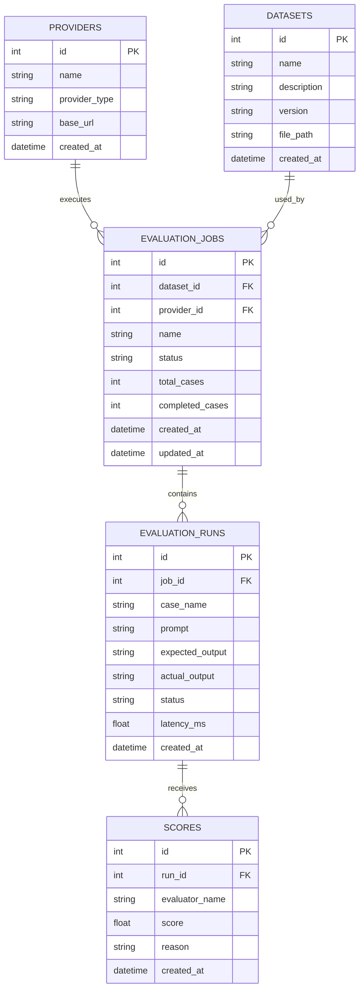

# EvalHub Architecture

## 一、项目定位

EvalHub 是一个多模型大语言模型自动化评测平台。

目前项目代码保存在 `40day-lab` 仓库中，核心功能位于
`evalhub_core`，每日测试和学习记录保存在对应的 `dayXX`
目录中。

## 二、五张核心数据表

EvalHub 计划包含：

1. `providers`：模型服务提供商
2. `datasets`：评测数据集
3. `evaluation_jobs`：完整评测任务
4. `evaluation_runs`：单条测试运行记录
5. `scores`：评分结果

Day 10 已使用SQLite实现：

- `datasets`
- `evaluation_jobs`
- `evaluation_runs`

`providers` 和 `scores` 将在后续阶段实现。

## 三、ER图

## 四、表关系

### providers 与 evaluation_jobs

一个模型Provider可以执行多个评测任务，是一对多关系。

### datasets 与 evaluation_jobs

一个数据集可以被多个评测任务重复使用，是一对多关系。

### evaluation_jobs 与 evaluation_runs

一个评测任务包含多条测试用例运行记录，是一对多关系。

### evaluation_runs 与 scores

一次运行可以同时接受多个评分器评分，是一对多关系。

## 五、Day 09与Day 10的关系

Day 09的Pydantic模型属于数据校验层，负责检查进入业务流程的数据。

Day 10的SQLite数据库属于持久化层，负责长期保存经过校验的数据。

两者概念保持一致，但数据库额外包含：

- 自增主键
- 外键
- 创建时间
- 更新时间
- 数据库约束

## 六、MVP边界

第一阶段包含：

- JSONL测试数据集
- MockProvider和一个真实Provider
- Exact Match评分
- JSON Schema评分
- SQLite数据库
- FastAPI接口
- Markdown或HTML报告

第一阶段暂不包含：

- 前端页面
- 模型训练
- 分布式任务系统
- 复杂权限系统